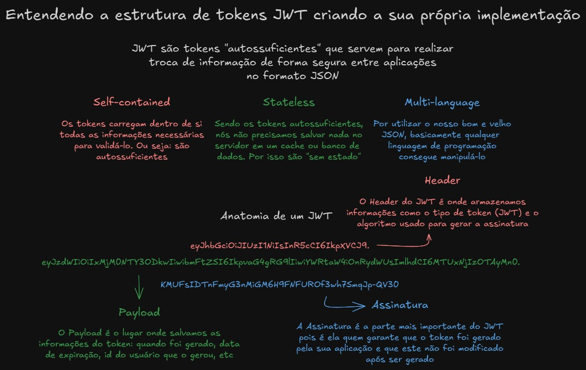

# 🔐 Understanding the Structure of JWT Tokens by Building Your Own Implementation

 🧩 This project was developed as part of the **"Understanding the Structure of JWT Tokens by Building Your Own Implementation"** live from the [JStack](https://jstack.com.br/) course. The goal is to explore and apply the fundamental concepts of JSON Web Tokens (JWT) in a hands-on way. In this project, we manually implement the processes of token generation and validation, without using external libraries like jsonwebtoken.This approach allows for a deeper understanding of how JWTs are structured and how encoding, signing, and verification mechanisms work, providing a solid foundation for using JWTs securely and effectively in real-world applications.

## 🎯 Objectives

 - Understand the key characteristics of a JWT, such as being *stateless*, *self-contained* and *language-agnostic*.
 - Learn how a JWT is structured, including its *Header*, *Payload* and *Signature*.
 - Learn how to **sign** and **verify** JWT tokens using *Base64 encoding* and *HMAC-SHA256* encryption, without relying on external libraries.


## 📘 Explanation in Brazilian Portuguese (pt-BR)

The image below summarizes the key concepts covered in the lesson about the fundamentals of JWT tokens. All the content is explained in Brazilian Portuguese (pt-BR), making it easier to understand for native speakers.


## 📄 Technologies Used

 - **Node.js**
 - **TypeScript**
 - **Crypto** (Node.js native module)

## ⚙️ Getting Started

### Prerequisites
Make sure you have the following installed:
 - **Node.js** (v18 or above)
 - **npm**, **Yarn** or **pnpm**

### Installation
Clone the repository:
```
git clone https://github.com/labs-jstack/understanding-structure-jwt-tokens.git
cd understanding-structure-jwt-tokens
```

Install the dependecies:
```
npm install
# or
yarn install
# or
pnpm install
```

To run the project locally:
```
npm run dev
# or
yarn dev
# or
pnpm dev
```

## Contributing
🤝 Feel free to open issues, suggest improvements or submit pull requests to help improve the project!

## License

📝 This project is licensed under the [MIT licensed](https://github.com/nestjs/nest/blob/master/LICENSE).

## Contact
✉️ Developed by João Henrique Fernandes.

[](https://www.linkedin.com/in/joaohenriquefernandes/)
[](https://github.com/joaohenriquefernandes)
